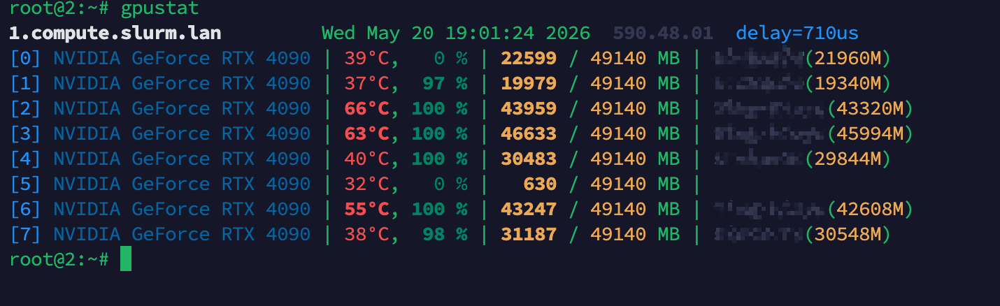
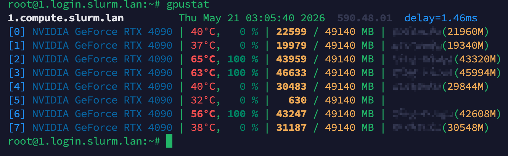

# gpustat4cluster

[中文](#gpustat4cluster) | [English](#gpustat4cluster-english)

gpustat4cluster 是一个面向 GPU 集群的低延迟 [gpustat](https://github.com/wookayin/gpustat) 风格状态查看工具。它由计算节点上的 server、登录节点或用户侧的 client-backend、以及命令行 client 组成。客户端日常使用体验和 `gpustat` 基本一致，可以理解为集群版 `gpustat`。

主要能力：

- 服务端通过 NVML 采集 GPU 温度、利用率、显存、进程 UID/PID/显存占用。
- 客户端后端通过组播发现服务端，也可以使用静态节点列表兜底。
- 服务端同时监听自研 UDP transport 和 TCP transport，客户端通过配置选择连接协议。
- 正常情况下推荐使用 UDP 来降低延迟；如果网络环境不允许 UDP，可以在配置文件中切换到 TCP，兼容性更好。
- 前端 CLI 通过 Unix Domain Socket 连接本机 client-backend，输出接近 `gpustat` 的彩色表格。
- 在 `gpustat` 风格体验之外，额外提供 `-user <USER>` 和 `-n <NODE_FILTER>` 过滤选项。
- 支持 `-i 0.05` 级别的持续刷新，最低刷新间隔会被限制到 50ms。
- deb/rpm/Arch 包会安装并启用 systemd service；client 包安装时如果系统没有 `gpustat` 命令，会自动创建 `gpustat -> gpustat4cluster-client` 符号链接。

## 架构

```text
compute node                         login/user node
+---------------------------+        +-----------------------------+
| gpustat4cluster-server    | <----> | gpustat4cluster-client-     |
| - GRES/NVML collector     | UDP/TCP| backend                     |
| - collector cache         |        | - multicast discovery       |
| - multicast announce      |        | - persistent node cache     |
| - UDP listener            |        | - UDS frontend API          |
| - TCP listener            |        +--------------+--------------+
+---------------------------+                       |
                                                   | UDS
                                                   v
                                      +-----------------------------+
                                      | gpustat4cluster-client      |
                                      | gpustat-like CLI            |
                                      +-----------------------------+
```

## 安装

### Ubuntu/Debian

服务端：

```bash
wget -O gpustat4cluster-server.deb https://github.com/TING-HiuYu/gpustat4cluster/releases/latest/download/gpustat4cluster-server-multiarch.deb
sudo apt install ./gpustat4cluster-server.deb
```

客户端：

```bash
wget -O gpustat4cluster-client.deb https://github.com/TING-HiuYu/gpustat4cluster/releases/latest/download/gpustat4cluster-client-multiarch.deb
sudo apt install ./gpustat4cluster-client.deb
```

### RHEL/CentOS/Rocky/AlmaLinux

服务端：

```bash
wget -O gpustat4cluster-server.rpm https://github.com/TING-HiuYu/gpustat4cluster/releases/latest/download/gpustat4cluster-server-multiarch.rpm
sudo dnf install ./gpustat4cluster-server.rpm
```

客户端：

```bash
wget -O gpustat4cluster-client.rpm https://github.com/TING-HiuYu/gpustat4cluster/releases/latest/download/gpustat4cluster-client-multiarch.rpm
sudo dnf install ./gpustat4cluster-client.rpm
```

### Arch Linux 客户端

```bash
wget -O gpustat4cluster-client.pkg.tar.zst https://github.com/TING-HiuYu/gpustat4cluster/releases/latest/download/gpustat4cluster-client-archlinux-multiarch.pkg.tar.zst
sudo pacman -U ./gpustat4cluster-client.pkg.tar.zst
```

服务安装后会默认 `enable --now`。常用诊断命令：

```bash
systemctl status gpustat4cluster-server
systemctl status gpustat4cluster-client
journalctl -u gpustat4cluster-server -f
journalctl -u gpustat4cluster-client -f
```

## 手动运行

服务端：

```bash
GPUSTAT4CLUSTER_CONFIG=/etc/gpustat4cluster/server.toml \
/usr/local/bin/gpustat4cluster-server
```

客户端后端：

```bash
GPUSTAT4CLUSTER_CONFIG=/etc/gpustat4cluster/client.toml \
/usr/local/bin/gpustat4cluster-client-backend
```

前端 CLI：

```bash
gpustat4cluster-client
gpustat4cluster-client -i 0.05
gpustat4cluster-client -n 1.compute
gpustat4cluster-client -user alice
```

如果 client 包安装时系统没有已有 `gpustat`，安装脚本会自动创建符号链接：

```text
gpustat -> gpustat4cluster-client
```

因此用户可以继续使用熟悉的命令：

```bash
gpustat
```

## 配置

默认配置路径：

- server: `/etc/gpustat4cluster/server.toml`
- client: `/etc/gpustat4cluster/client.toml`

也可以用环境变量覆盖：

```bash
GPUSTAT4CLUSTER_CONFIG=/path/to/client.toml gpustat4cluster-client-backend
```

### `[connecting]`

```toml
[connecting]
port_range = [30000, 40000]
multicast_addr = "239.0.0.1:4000"
protocol = "udp" # client only: "udp" or "tcp"
udp_port = 0      # server only, 0 means auto-pick from port_range
tcp_port = 0      # server only, 0 means auto-pick from port_range
udp_mtu = 0       # 0 means auto-detect route MTU, fallback 1200
heartbeat_interval = 5
connection_idle_timeout = 10
max_connections = 64
discover_wait_secs = 5
multicast_retry_limit = 5
# multicast_outbound_ip = ["192.0.2.10"]
```

Key 说明：

- `port_range`: server 自动选择 UDP/TCP 端口的范围。
- `multicast_addr`: client-backend 和 server 必须在同一个组播地址和端口上发现彼此。
- `protocol`: client-backend 使用的服务端连接协议，支持 `udp` 或 `tcp`。
- `udp_port` / `tcp_port`: server 监听端口。设为 `0` 时自动选择可用端口，并在组播 announce 中通知客户端。
- `udp_mtu`: UDP 分片 MTU。设为 `0` 时按路由自动探测，失败时使用 1200。
- `connection_idle_timeout`: UDP/TCP 连接空闲超时，单位秒。
- `max_connections`: server 允许的最大客户端连接数；client-backend 允许连接的最大服务端数。
- `discover_wait_secs`: client-backend 启动时等待组播发现响应的秒数。
- `multicast_retry_limit`: server 启动 announce 失败的重试上限。
- `multicast_outbound_ip`: 多网卡或无默认组播路由时配置本机出口 IPv4，可写多个。

### `[services]`

```toml
[services]
cache_ttl_ms = 40
collector_interval_ms = 25
latency_display = true
# uds_path = "/run/gpustat4cluster/client.sock"
```

Key 说明：

- `cache_ttl_ms`: client-backend 本地记录缓存 TTL。前端发起 QUERY 时，如果缓存过期才向服务端刷新。
- `collector_interval_ms`: server 后台 collector 轮询间隔，默认 25ms。
- `latency_display`: CLI 是否在 hostname 旁显示实时查询延迟。
- `uds_path`: client CLI 和 client-backend 之间的 UDS 路径。默认 `/run/gpustat4cluster/client.sock`，一般不需要配置。

### `[runtime]` server only

```toml
[runtime]
# nvml_lib_path = "/usr/lib/x86_64-linux-gnu/libnvidia-ml.so.1"
```

Key 说明：

- `nvml_lib_path`: NVML 动态库路径。默认加载 `libnvidia-ml.so`。如果系统只有版本化库，比如 `/usr/lib/x86_64-linux-gnu/libnvidia-ml.so.1`，就在这里显式配置。
- 不要配置 CUDA stubs 里的 `libnvidia-ml.so`，它只用于编译链接，不提供真实运行时数据。

## 静态节点兜底

当组播不可用时，可以给 client-backend 设置静态节点。端口应填写所选协议对应的服务端端口。

```bash
GPUSTAT4CLUSTER_STATIC_NODES=172.16.108.10:30000 \
GPUSTAT4CLUSTER_CONFIG=/etc/gpustat4cluster/client.toml \
gpustat4cluster-client-backend
```

## UDP 和 TCP 延迟

默认 UDP 协议适合低延迟集群内网。UDP transport 使用二进制 frame，并在 datagram 层带 chunk 信息和相邻 chunk 校验。若网络阻断 UDP，可将客户端切换为 TCP；TCP 更兼容，但通常延迟更高。

```toml
[connecting]
protocol = "udp" # or "tcp"
```

UDP 示例：



TCP 示例：



## CLI 用法

```bash
gpustat4cluster-client [OPTIONS]
```

常用参数：

- `-i [SEC]`, `--interval [SEC]`: watch 模式，默认 2 秒，最小 0.05 秒。
- `-n <FILTER>`: 按 hostname、IP 或 connection id 过滤节点。
- `-user <USER>`: 只显示指定用户相关 GPU 行或进程。
- `--json`: 输出 JSON。
- `--no-processes`: 隐藏进程摘要。
- `-c`, `--show-cmd`: 显示命令。
- `-u`, `--show-user`: 显示用户名。
- `-p`, `--show-pid`: 显示 PID。
- `-a`, `--show-all`: 同时显示 user/cmd/pid。
- `--no-latency`: 不显示延迟。
- `--backend-socket <PATH>`: 指定 client-backend UDS。

## 构建

本地构建前加载 Rust 编译器模块：

```bash
source /opt/shell_related/z00_lmod.sh && module load compiler/rust
cargo test --workspace
```

打包脚本：

```bash
GPUSTAT4CLUSTER_DEB_MULTIARCH=1 scripts/package-deb.sh
GPUSTAT4CLUSTER_RPM_MULTIARCH=1 scripts/package-rpm.sh
scripts/package-archlinux-client.sh
```

---

# gpustat4cluster English

[中文](#gpustat4cluster) | [English](#gpustat4cluster-english)

gpustat4cluster is a low-latency, [gpustat](https://github.com/wookayin/gpustat)-style GPU status tool for GPU clusters. It is made of a server running on compute nodes, a client backend running on login/user nodes, and a command-line frontend. The day-to-day client experience is intentionally close to `gpustat`, so it can be used as a cluster-aware `gpustat`.

Key features:

- The server collects GPU temperature, utilization, memory, process UID/PID, and per-process memory usage through NVML.
- The client backend discovers servers via multicast and can fall back to static node lists.
- The server listens on both custom UDP transport and TCP transport; the client backend chooses the protocol from config.
- UDP is recommended by default for lower latency. If UDP is unavailable in your network, switch the client config to TCP for better compatibility.
- The CLI talks to the local client backend over a Unix Domain Socket and renders a `gpustat`-like colored table.
- In addition to the familiar `gpustat` experience, gpustat4cluster adds `-user <USER>` and `-n <NODE_FILTER>` filters.
- Watch mode supports refresh intervals down to 50ms, for example `-i 0.05`.
- deb/rpm/Arch packages install and enable systemd services; if the client package does not find an existing `gpustat` command, it automatically creates the `gpustat -> gpustat4cluster-client` symlink.

## Installation

Ubuntu/Debian server:

```bash
wget -O gpustat4cluster-server.deb https://github.com/TING-HiuYu/gpustat4cluster/releases/latest/download/gpustat4cluster-server-multiarch.deb
sudo apt install ./gpustat4cluster-server.deb
```

Ubuntu/Debian client:

```bash
wget -O gpustat4cluster-client.deb https://github.com/TING-HiuYu/gpustat4cluster/releases/latest/download/gpustat4cluster-client-multiarch.deb
sudo apt install ./gpustat4cluster-client.deb
```

RHEL/CentOS/Rocky/AlmaLinux server:

```bash
wget -O gpustat4cluster-server.rpm https://github.com/TING-HiuYu/gpustat4cluster/releases/latest/download/gpustat4cluster-server-multiarch.rpm
sudo dnf install ./gpustat4cluster-server.rpm
```

RHEL/CentOS/Rocky/AlmaLinux client:

```bash
wget -O gpustat4cluster-client.rpm https://github.com/TING-HiuYu/gpustat4cluster/releases/latest/download/gpustat4cluster-client-multiarch.rpm
sudo dnf install ./gpustat4cluster-client.rpm
```

Arch Linux client:

```bash
wget -O gpustat4cluster-client.pkg.tar.zst https://github.com/TING-HiuYu/gpustat4cluster/releases/latest/download/gpustat4cluster-client-archlinux-multiarch.pkg.tar.zst
sudo pacman -U ./gpustat4cluster-client.pkg.tar.zst
```

## Configuration

Default config paths:

- server: `/etc/gpustat4cluster/server.toml`
- client: `/etc/gpustat4cluster/client.toml`

Important keys:

- `connecting.protocol`: client-backend transport protocol, `udp` or `tcp`.
- `connecting.udp_port` / `connecting.tcp_port`: server listen ports. `0` means auto-pick and announce through multicast.
- `connecting.udp_mtu`: UDP fragmentation MTU. `0` means route MTU auto-detection with a 1200-byte fallback.
- `connecting.max_connections`: maximum connected peers.
- `services.cache_ttl_ms`: client-backend cache TTL.
- `services.collector_interval_ms`: server collector polling interval, default 25ms.
- `services.latency_display`: whether the CLI shows query latency next to the hostname.
- `runtime.nvml_lib_path`: optional server-side NVML runtime library path.

## CLI usage

```bash
gpustat4cluster-client
gpustat4cluster-client -i 0.05
gpustat4cluster-client -n 'compute[01-08]'
gpustat4cluster-client -user alice
gpustat4cluster-client --json
```

If the client package creates the compatibility symlink, users can run:

```bash
gpustat
```

## UDP/TCP

UDP is the default low-latency path. It sends the same binary frame payloads as TCP, with datagram chunk metadata and neighboring chunk checksums. TCP is the compatibility fallback when UDP is blocked or unstable.

